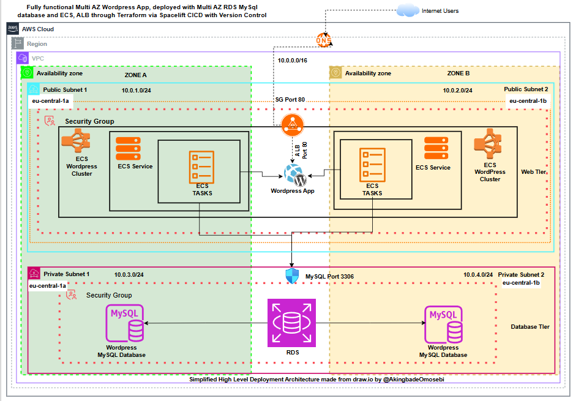
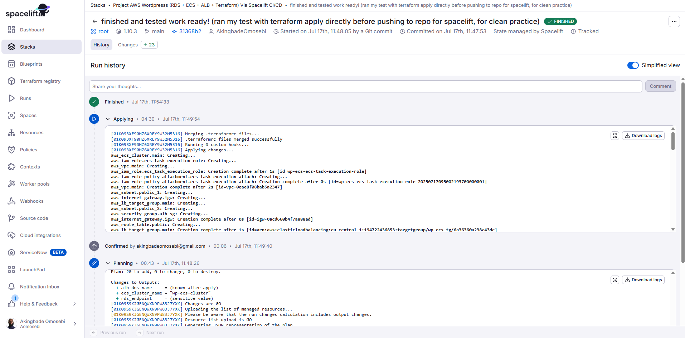
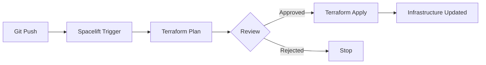
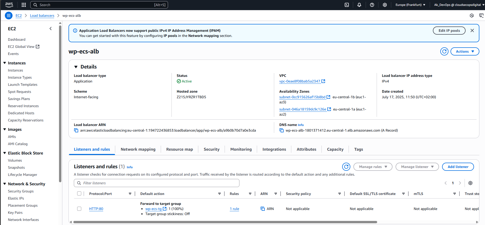
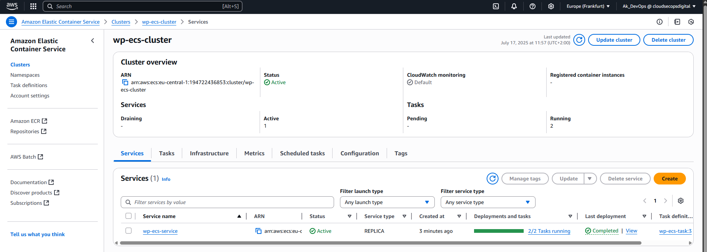
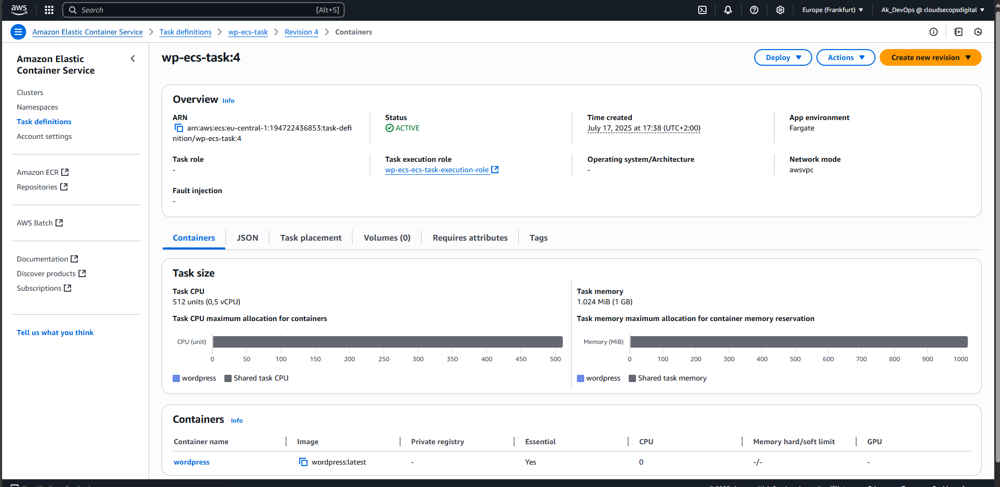
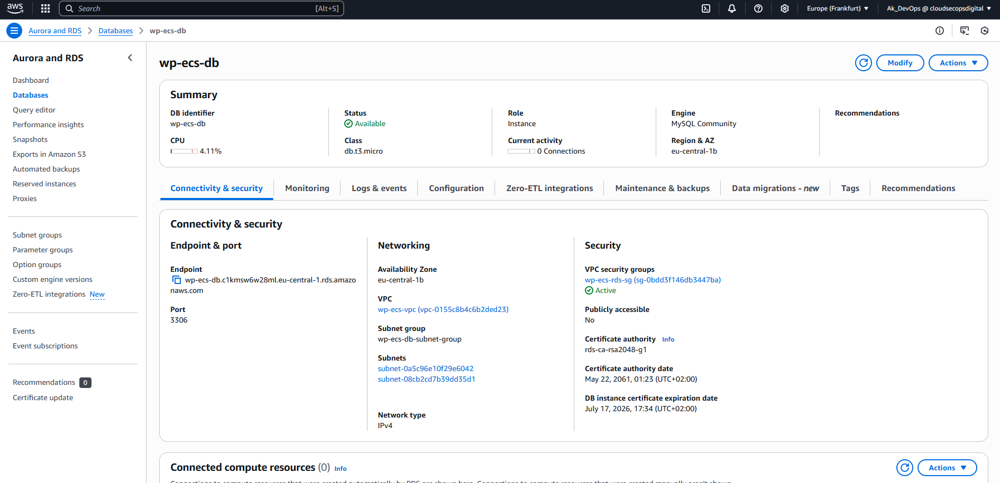
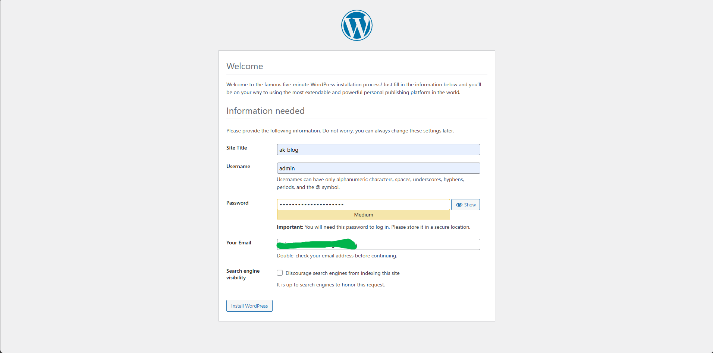

# Multi-AZ WordPress Deployment on AWS ECS with Terraform & Spacelift

[](https://www.terraform.io/)
[](https://aws.amazon.com/)
[](https://spacelift.io/)

A production-grade, highly available WordPress application deployed on AWS using Infrastructure as Code (Terraform) with automated CI/CD through Spacelift.

**Author:** Akingbade Omosebi  
**Region:** eu-central-1 (Frankfurt)  
**Status:** Production-tested ✅

---

## 📋 Table of Contents

- [Overview](#overview)
- [Architecture](#architecture)
- [Infrastructure Components](#infrastructure-components)
- [Security Design](#security-design)
- [Prerequisites](#prerequisites)
- [Deployment Guide](#deployment-guide)
- [CI/CD Pipeline](#cicd-pipeline)
- [Cost Considerations](#cost-considerations)
- [Screenshots](#screenshots)
- [Cleanup](#cleanup)
- [Contact](#contact)

---

## 🎯 Overview

This project demonstrates enterprise-level cloud infrastructure deployment using:

- **AWS ECS Fargate** for serverless container orchestration
- **Application Load Balancer (ALB)** for traffic distribution
- **Amazon RDS MySQL** with Multi-AZ failover for database resilience
- **Terraform** for infrastructure as code
- **Spacelift** for GitOps-driven CI/CD automation

### Key Features

✅ Multi-AZ architecture for high availability  
✅ Zero-downtime deployments with ECS rolling updates  
✅ Automated infrastructure provisioning via Terraform  
✅ GitOps workflow with Spacelift integration  
✅ Security groups implementing least-privilege access  
✅ Private subnet isolation for database tier  
✅ Scalable container-based architecture  

---

## 🏗️ Architecture



### Network Design

**VPC:** `10.0.0.0/16` (65,536 IPs)

| Component | Subnets | CIDR | Availability Zones |
|-----------|---------|------|-------------------|
| Public Subnet 1 | ALB, ECS Tasks | `10.0.1.0/24` | eu-central-1a |
| Public Subnet 2 | ALB, ECS Tasks | `10.0.2.0/24` | eu-central-1b |
| Private Subnet 1 | RDS Primary | `10.0.3.0/24` | eu-central-1a |
| Private Subnet 2 | RDS Standby | `10.0.4.0/24` | eu-central-1b |

### Traffic Flow
```
Internet Users
     ↓
Application Load Balancer (Port 80)
     ↓
ECS Fargate Tasks (Port 80)
     ↓
RDS MySQL Database (Port 3306)
```

---

## 🧱 Infrastructure Components

### 1. **Networking (`vpc.tf`)**
- VPC with DNS support enabled
- Internet Gateway for public connectivity
- 2 Public subnets (ALB + ECS)
- 2 Private subnets (RDS)
- Route tables with appropriate associations

### 2. **Security Groups (`sg.tf`)**
- **ALB Security Group:** Allows HTTP (80) from `0.0.0.0/0`
- **ECS Security Group:** Allows traffic only from ALB
- **RDS Security Group:** Allows MySQL (3306) only from ECS

### 3. **Application Load Balancer (`alb.tf`)**
- Internet-facing ALB across 2 AZs
- Target group with health checks (`/wp-admin/install.php`)
- HTTP listener forwarding to ECS tasks

### 4. **ECS Cluster (`ecs.tf`)**
- Fargate launch type (serverless)
- Task definition: 512 CPU, 1024 MB memory
- WordPress container from Docker Hub
- Environment variables for RDS connection
- Auto-scaling capable service

### 5. **RDS Database (`rds.tf`)**
- Engine: MySQL 8.0
- Instance: `db.t3.micro`
- Multi-AZ enabled for automatic failover
- 20 GB GP2 storage
- Automated backups with 7-day retention
- Private subnet placement

### 6. **Variables (`variables.tf`)**
- Parameterized configuration
- Sensitive variables marked appropriately
- Default values for non-sensitive parameters

### 7. **Outputs (`outputs.tf`)**
- ALB DNS name (application endpoint)
- ECS cluster name
- RDS endpoint (for troubleshooting)

---

## 🔒 Security Design

### Network Segmentation
- **Public Subnets:** Internet-accessible resources (ALB, ECS)
- **Private Subnets:** No direct internet access (RDS)

### Security Group Rules (Least Privilege)
```
┌─────────────────────┐
│   Internet (0/0)    │
└──────────┬──────────┘
           │ Port 80
           ▼
┌─────────────────────┐
│   ALB Security SG   │
└──────────┬──────────┘
           │ Port 80
           ▼
┌─────────────────────┐
│   ECS Security SG   │
└──────────┬──────────┘
           │ Port 3306
           ▼
┌─────────────────────┐
│   RDS Security SG   │
└─────────────────────┘
```

### Best Practices Implemented
✅ RDS isolated in private subnets  
✅ Security groups use source SG references (not CIDR ranges)  
✅ Database credentials managed via Terraform variables (Spacelift secrets)  
✅ No hardcoded credentials in code  

---

## 📦 Prerequisites

### Required Tools
- **Terraform:** >= 1.0.0
- **AWS CLI:** Configured with appropriate credentials
- **Spacelift Account:** (Optional, for CI/CD)

### AWS Permissions Required
- VPC, Subnet, IGW, Route Table management
- Security Group creation
- ALB, Target Group, Listener management
- ECS Cluster, Service, Task Definition
- RDS Instance provisioning
- IAM Role creation for ECS Task Execution

---

## 🚀 Deployment Guide

### Option 1: Local Deployment
```bash
# 1. Clone the repository
git clone https://github.com/AkingbadeOmosebi/rds-ecs-wordpress-terraform.git
cd rds-ecs-wordpress-terraform/Infrastructure(Terraform)

# 2. Create terraform.tfvars
cat <<EOF > terraform.tfvars
db_username = "admin"
db_password = "YourSecurePassword123!"
EOF

# 3. Initialize Terraform
terraform init

# 4. Review the execution plan
terraform plan

# 5. Deploy infrastructure
terraform apply -auto-approve

# 6. Get ALB DNS name
terraform output alb_dns_name
```

### Option 2: Spacelift Deployment (Recommended)

1. **Connect Repository:** Link GitHub repo to Spacelift
2. **Configure Stack:** Create stack pointing to `Infrastructure(Terraform)/`
3. **Set Secrets:** Add `db_username` and `db_password` as environment variables
4. **Trigger Plan:** Push commits trigger automatic `terraform plan`
5. **Review & Apply:** Approve plan to deploy infrastructure

---

## 🔄 CI/CD Pipeline



### Automated Workflow


### Pipeline Features
- **Automatic Planning:** Every commit triggers `terraform plan`
- **Manual Approval:** Human review before applying changes
- **State Management:** Remote state handled by Spacelift
- **Secret Management:** Credentials stored securely in Spacelift
- **Drift Detection:** Identifies manual changes to infrastructure

---

## 💰 Cost Considerations

### Estimated Monthly Costs (eu-central-1)

| Service | Specification | Estimated Cost |
|---------|--------------|----------------|
| ECS Fargate | 2 tasks × 0.5 vCPU × 1 GB | ~$15 |
| ALB | 1 ALB + data transfer | ~$20 |
| RDS MySQL | db.t3.micro Multi-AZ | ~$30 |
| Data Transfer | Minimal usage | ~$5 |
| **Total** | | **~$70/month** |

### Cost Optimization Tips
- Use Fargate Spot for non-production
- Consider Reserved Instances for RDS
- Implement Auto Scaling policies
- Set up AWS Budgets alerts

---

## 📸 Screenshots

### Application Load Balancer


### ECS Cluster


### ECS Task Definition


### RDS Database


### WordPress Installation


---

## 🧹 Cleanup

**Important:** Destroy resources when done to avoid charges
```bash
# Via Terraform CLI
cd Infrastructure(Terraform)/
terraform destroy -auto-approve

# Via Spacelift
# Navigate to Stack → Settings → Delete Stack
```

### Manual Cleanup Checklist
- [ ] Verify ECS services are deleted
- [ ] Confirm RDS instance is removed
- [ ] Check ALB/Target Groups are gone
- [ ] Validate VPC and subnets are deleted
- [ ] Review AWS Cost Explorer for any remaining charges

---

## 📚 Technical Deep Dive

For a detailed walkthrough with architecture explanations and screenshots:  
👉 **[Read the full article on Dev.to](https://dev.to/akingbade_omosebi/deploying-a-fully-functional-multi-az-wordpress-app-on-aws-ecs-rds-with-terraform-spacelift-1e99)**

---

## 🤝 Contact

**Akingbade Omosebi**  
Platform Engineer | DevOps Specialist

- 🌐 [GitHub](https://github.com/AkingbadeOmosebi)
- 💼 [LinkedIn](https://linkedin.com/in/akingbade-omosebi)
- 📝 [Dev.to](https://dev.to/akingbade_omosebi)

---

## 📄 License

This project is open source and available for educational purposes.

---

## ⭐ Acknowledgments

- AWS Documentation
- Terraform Registry
- Spacelift Community

## Author
```
Akingbade Omosebi    | Linkedin.com/in/aomosebi/    |   https://dev.to/akingbade_omosebi   | Berlin - De
